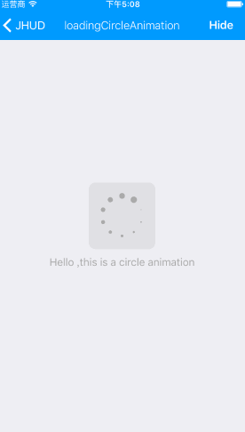
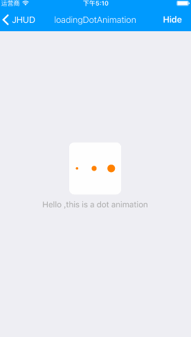
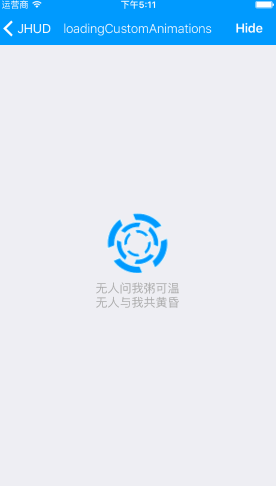

# JHUD

####`JHUD` is a full screen of the HUD when loading the data (Objective-C) .


  
 
 
 


## Requirements

`JHUD` works on "Xcode 7.3 , iOS 8+  and requires ARC to build. 
You will need the latest developer tools in order to build `JHUD`. Old Xcode versions might work, but compatibility will not be explicitly maintained.

### Source files

Alternatively you can directly add the `JHUD.h` and `JHUD.m` source files to your project.

1. Download the latest code version or add the repository as a git submodule to your git-tracked project.
2. Open your project in Xcode, then drag and drop `JHUD.h` and `JHUD.m` onto your project. Make sure to select Copy items when asked if you extracted the code archive outside of your project.
3. Include JHUD wherever you need it with `#import "JHUD.h"`.


## Usage

```
hudView = [[JHUD alloc]initWithFrame:self.view.bounds];

hudView.messageLabel.text = @"This is a default activityView .";

//show
[hudView showAtView:self.view hudType:JHUDLoadingTypeActivity];

//hide 
[hudView hideHudView];

```

For more examples, including how to use JHUD , take a look at the bundled demo project. API documentation is provided in the header file (JHUD.h).


## Contacts

#####If you wish to contact me, email at: hi@jinxiansen.com

######Tencent QQ: 463424863
######新浪微博 : [@晋先森](http://weibo.com/3205872327/)
######Twitter : [@jinxiansen](https://twitter.com/jinxiansen)

## License

JWiFi is released under the [MIT license](LICENSE). See LICENSE for details.